#  🎫 Ticketing System
Ticketing system is crucial as it tracks, organizes, and prioritizes customer issues, ensuring efficient resolution, accountability, and improved service delivery. It also provides valuable data for performance analysis and continuous improvement. This is the reason I am using Jira Service Management to experience how ticket is created, solved, assigned, commented, and responded to the customer. I have created and resolved 2 tickets.

## Ticket 1: 404 error on website, Priority: Low
### Creating Ticket:
Step 1: Create a customer request

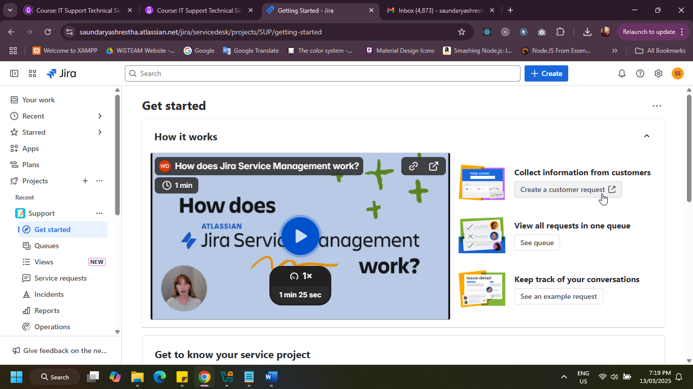

Step 2: Report a system problem

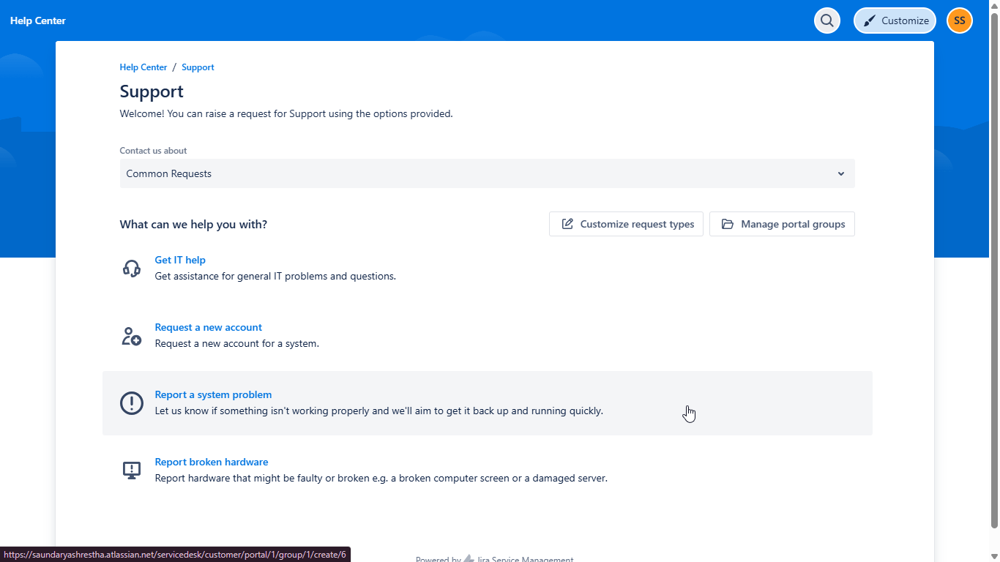

Step 3: Creating ticket with description, problem summary and urgency level

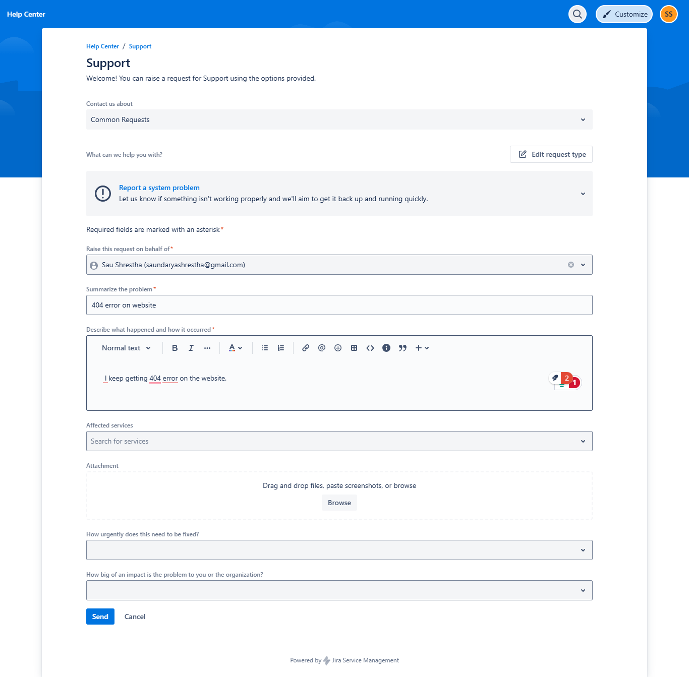

The following one is the information of ticket which can include error summary, its description, comments of customer and help desk team.

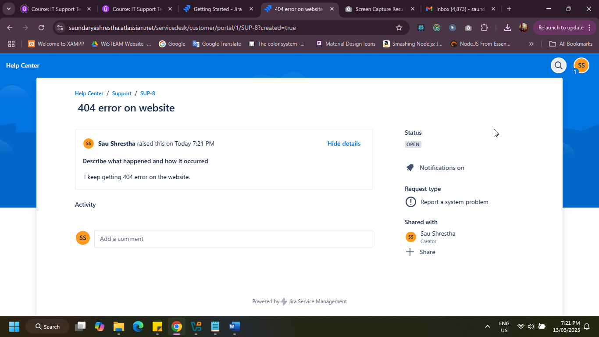

### Resolving Ticket:
Step 1: Viewing the active ticket

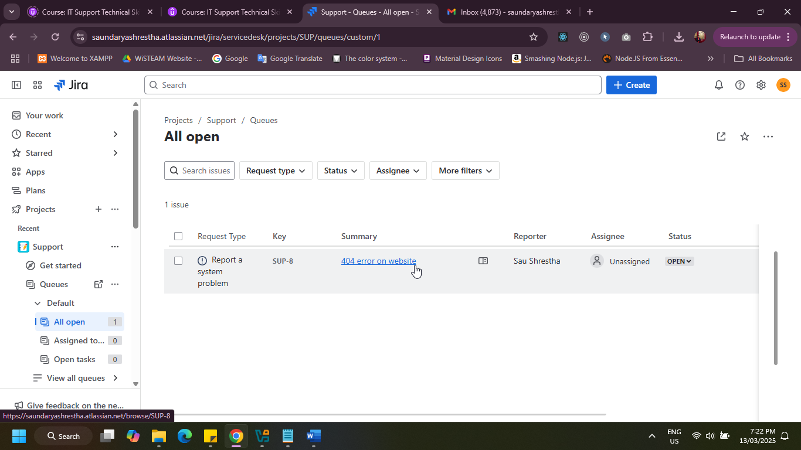

Step 2: Viewing Ticket urgency, problem, its description, and comments. 

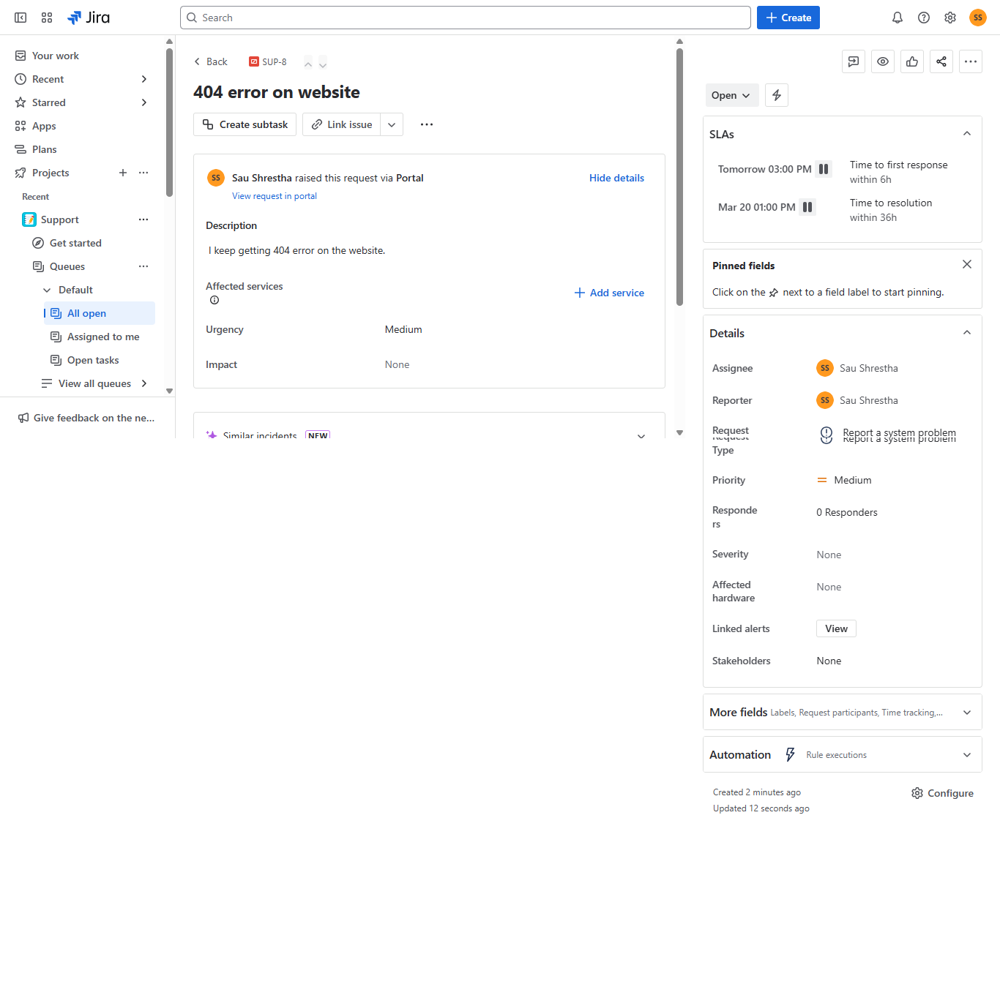

Step 3: After resolving the issue closing the ticket by Responding to Customer

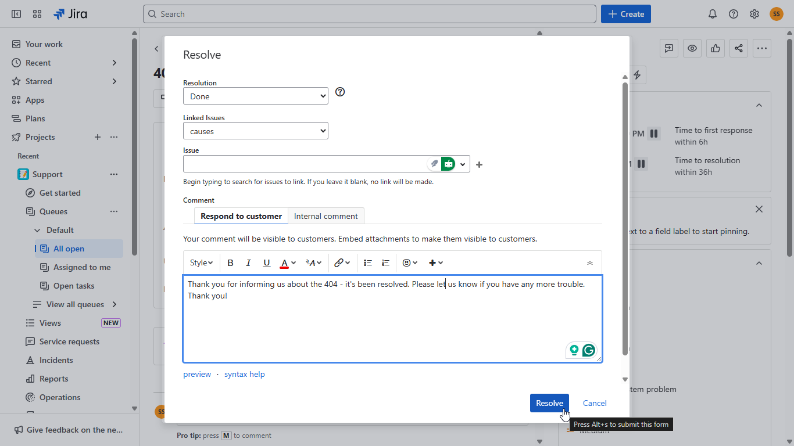

The following one shows how it appears after resolving the ticket.

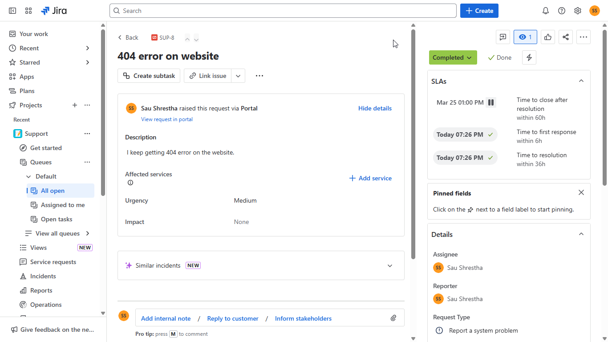

## Ticket 2: Account Locked Outlook issue, Priority: Highest
### Creating Ticket:
Step 1: Creating ticket with summary of issue, its description with priority: highest and urgency criticial

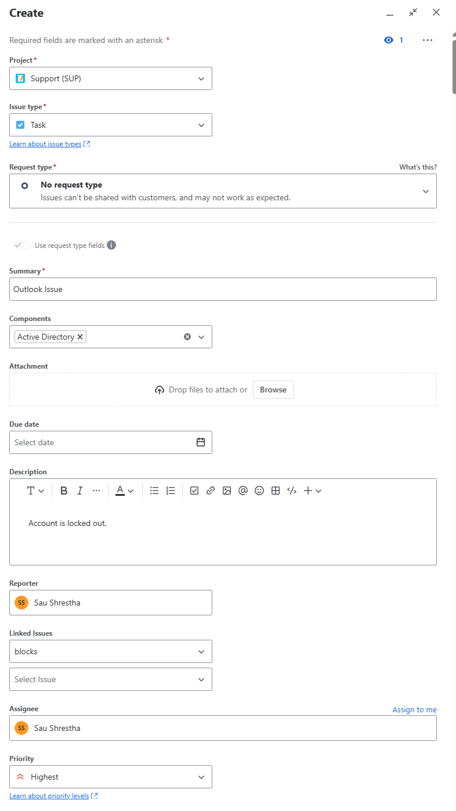

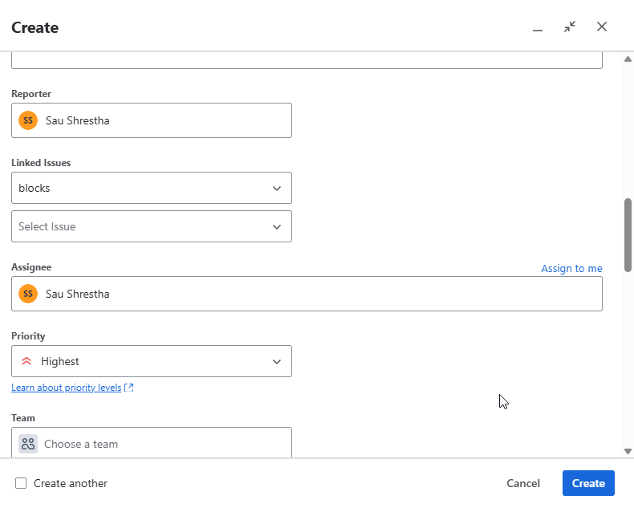

### Resolving Ticket:
Step 1: Viewing the active ticket

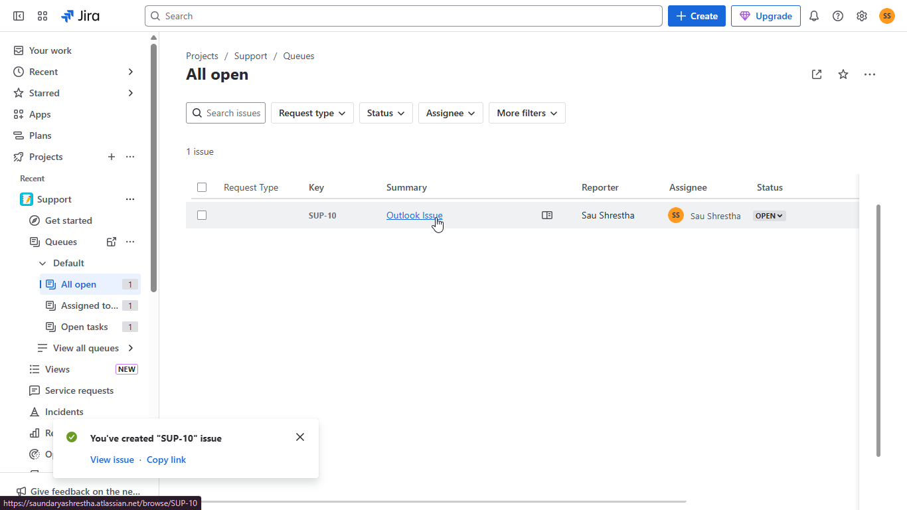

Step 2: Observing ticket urgency, issue, its description and comments

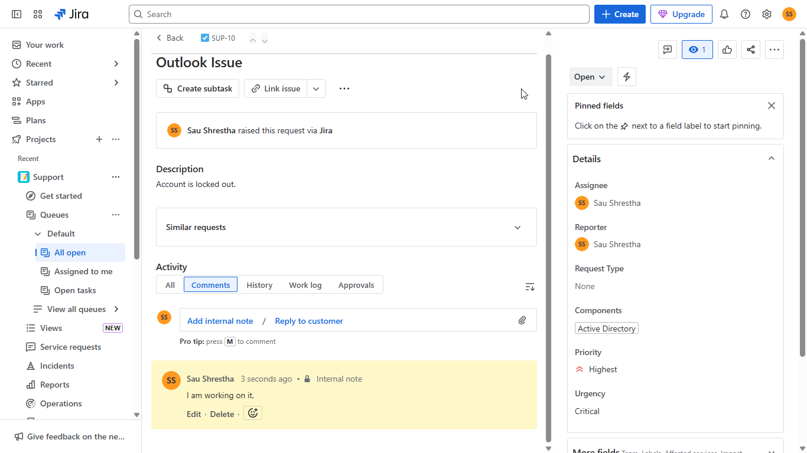

Step 3: Informing customer about working on resolving the issue.

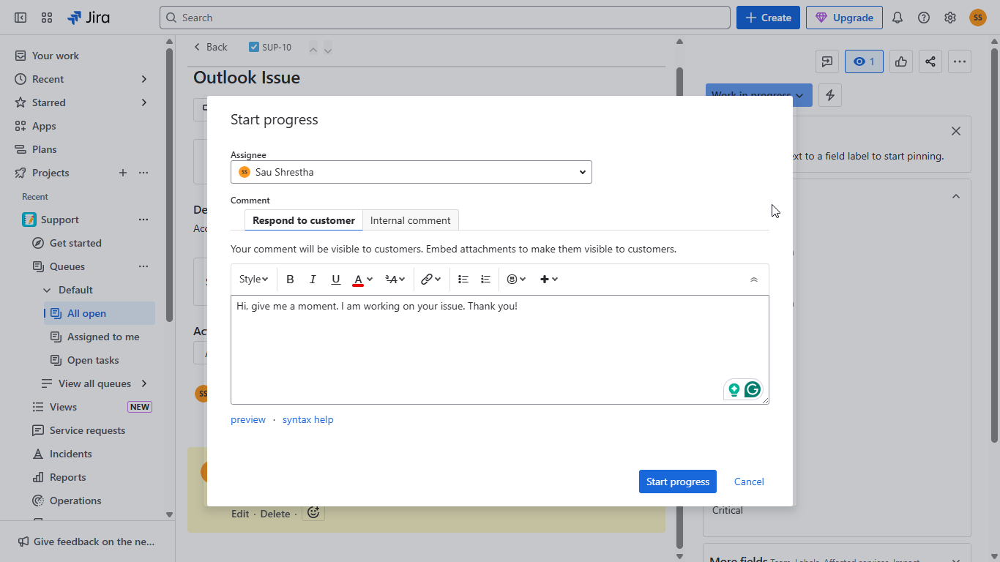

Step 4: Informing customer that the issue is resolved.

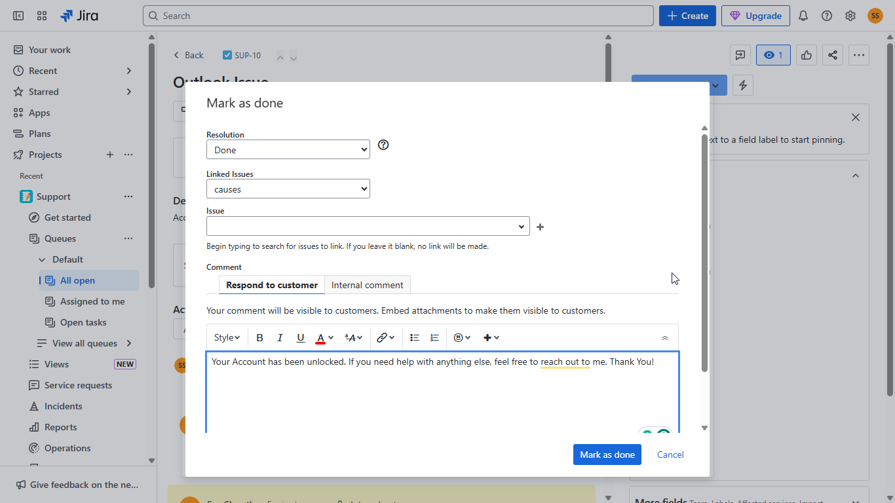

The following one is the summary of the above ticket after resolving the issue.

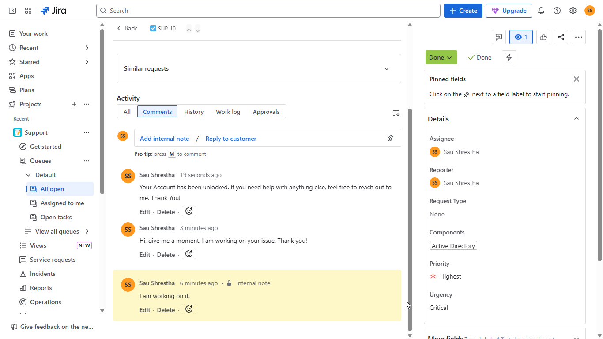