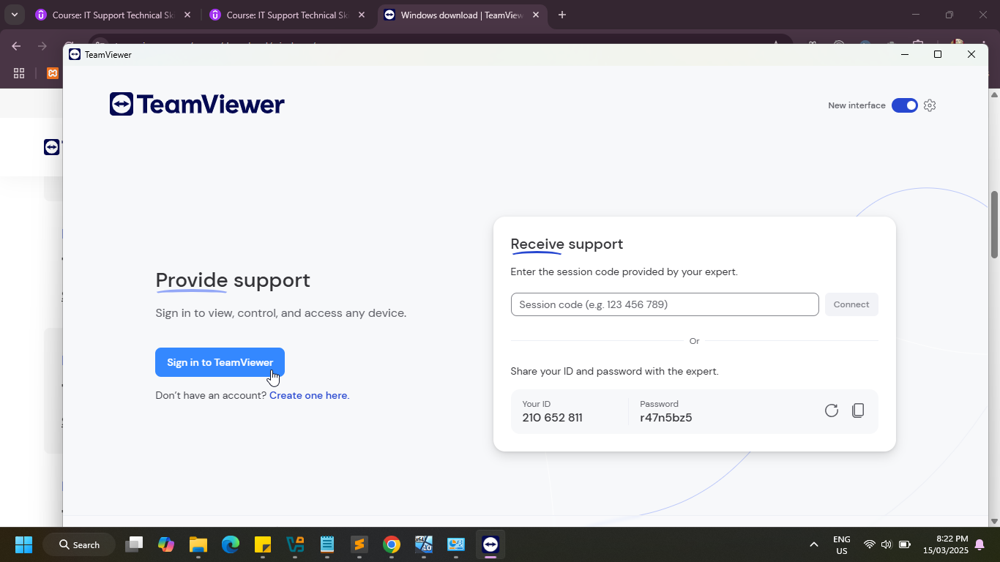

# 🖥️🌐🔧 Remote Access and Support
Remote connectivity is crucial for efficient troubleshooting, seamless collaboration, and problem resolution, regardless of physical location. While several popular remote connectivity tools, such as Zoho, and Anydesk, are available, I prefer TeamViewer for its user-friendly interface, smooth performance, and free license for personal use. 

[Download](https://www.teamviewer.com/en-au/download/free-download-with-license-options/)

I am using my laptop as a help desk machine and VirtualBox to set up another computer as a support-receiving machine

**`Help desk Machine | Local Machine | Client Machine: `**

Step 1: 
Download and install TeamViewer full client followed by sign in. As of today, the installation file size is 68.6 MB.

 

 

Step 2: Create New session

In this support ticket 116 720 447 is the session id which will be used later by the remote machine.

**`  Support-Receiving Machine | Remote Machine | Host Machine:`** 

Step 3:
Download and install TeamViewer QuickSupport. As of today, the installation file size is 30.9 MB.

Step 4:
TeamViewer simplifies this step for the remote machine, as it doesn't require the user to create an account or sign in.

**Just enter the session code provided by the helpdesk team and connect. In this support ticket it is 116 720 447**

**`Help Desk Machine`** 

Step 5:
Now, helpdesk machine will get prompt to start the session. Just Click Start session

**`Support-Receiving Machine`** 

Step 6: Then, remote machine receive prompt to Verify user followed by trust and Allow access.

**`Help Desk Machine`** 

Step 7: Next, helpdesk machine gains access to control remote machine. Helpdesk team now can configure the system, uninstall the program, reboot in safe mode. That's how helpdesk team fix the issue with the remote connectivity software.

